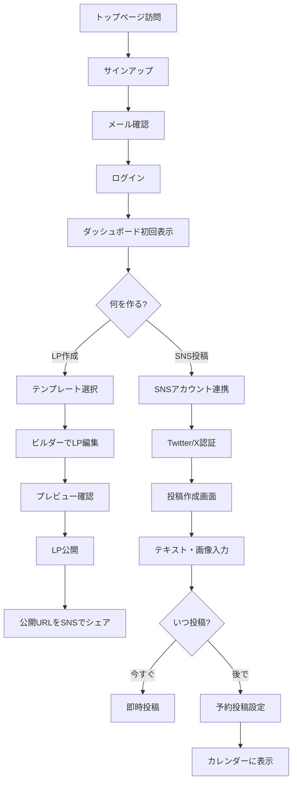
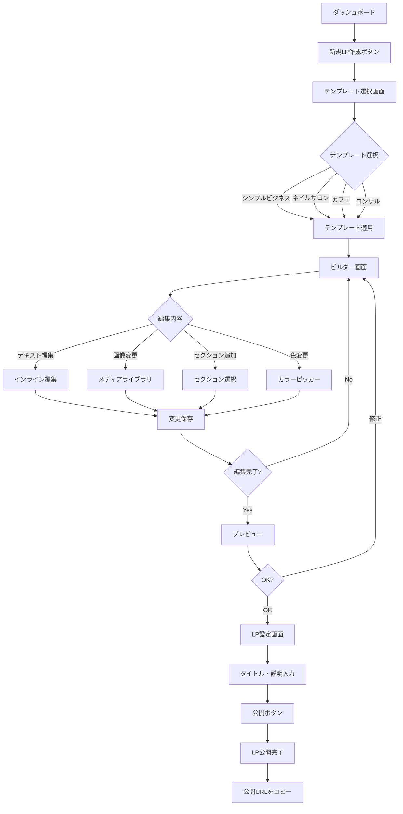
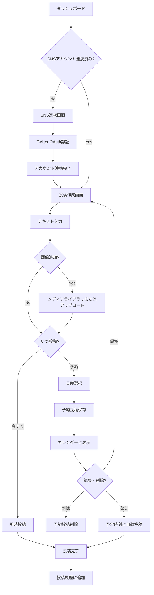
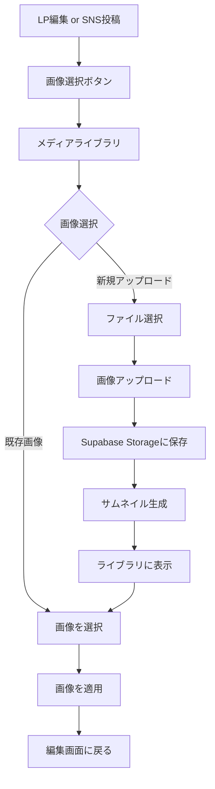
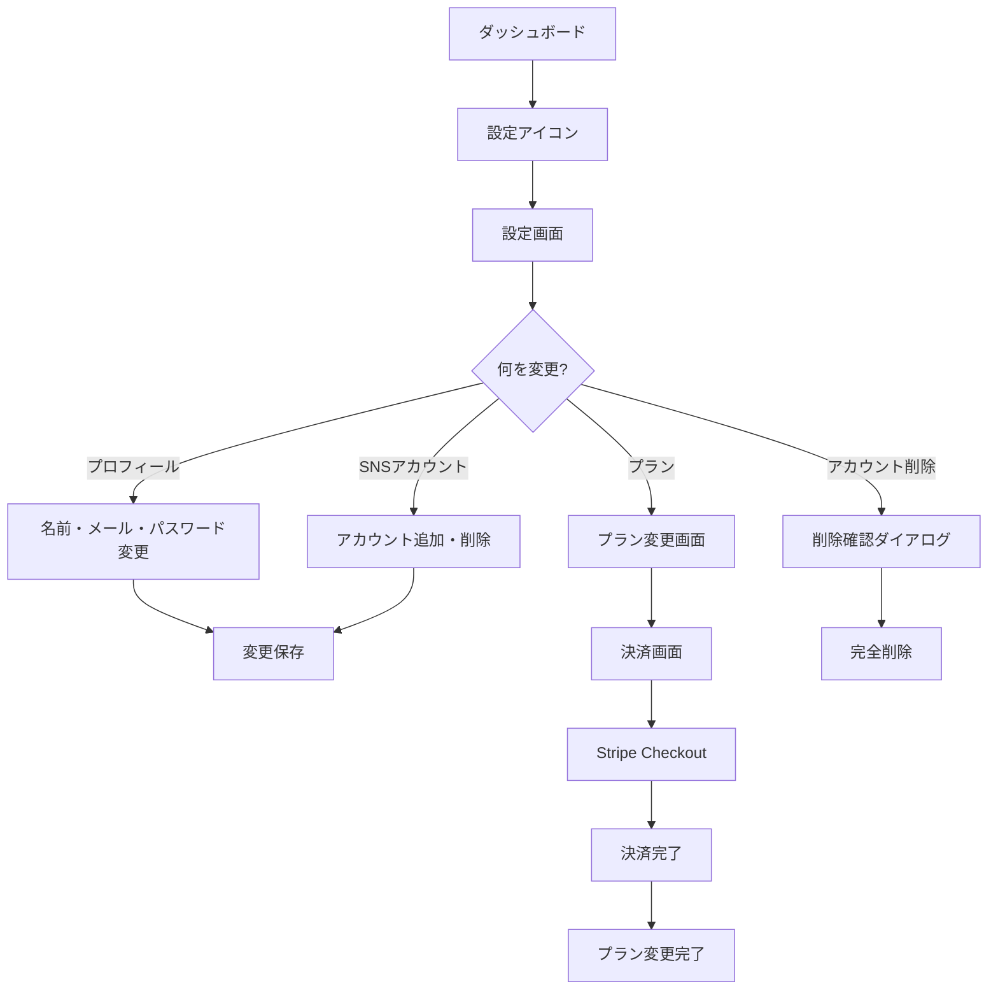

# 機能設計書

## 作成日
2025-11-20

## 目次
1. [基本方針](#基本方針)
2. [MVPスコープ定義](#mvpスコープ定義)
3. [機能一覧](#機能一覧)
4. [優先順位付け](#優先順位付け)
5. [ユーザーフロー](#ユーザーフロー)

---

## 基本方針

### サービスコンセプト
「個人事業主・副業者が、LP構築とSNS管理を1つのツールで完結できるシンプルなオールインワンプラットフォーム」

### 設計原則

#### 1. シンプル小規模実装 ⭐⭐⭐
- **過度な抽象化を避ける**
- **必要最小限の機能でMVPリリース**
- **学習コスト最小化**
- 複雑な設定は避け、デフォルトで動作

#### 2. 個人開発規模を意識
- **スケールは後回し**
- **初期ユーザー数: 100-1000人を想定**
- **機能追加は需要を見てから**

#### 3. 差別化は最小限
- 既存ツールの「良いとこ取り」でOK
- オリジナル機能よりも「統合」に注力
- Wixの使いやすさ + Bufferのシンプルさ

---

## MVPスコープ定義

### ターゲットユーザー
- 個人事業主（ネイルサロン、カフェ、コンサル等）
- 副業を始めたばかりの会社員
- フリーランス（デザイナー、ライター、コーチ等）
- **技術レベル**: 初心者〜中級者
- **予算**: 月額3,000円以下

### 提供価値
1. **時間節約**: 複数ツールの学習・管理時間を削減
2. **コスト削減**: 複数サブスクを1つに統合（月額8,000円 → 2,000円）
3. **簡単さ**: 5分でLP公開、10分でSNS予約投稿

---

## 機能一覧

### Phase: Must Have（MVP必須機能）

#### 1. ユーザー認証
| 機能ID | 機能名 | 説明 | 優先度 |
|--------|--------|------|--------|
| AUTH-01 | サインアップ | メール + パスワードで新規登録 | P0 |
| AUTH-02 | ログイン | メール + パスワードでログイン | P0 |
| AUTH-03 | ログアウト | セッション終了 | P0 |
| AUTH-04 | パスワードリセット | メールでリセットリンク送信 | P1 |
| AUTH-05 | メール確認 | 登録時のメールアドレス確認 | P1 |

**実装方針**: Supabase Authを使用（シンプル、早い）

---

#### 2. ダッシュボード
| 機能ID | 機能名 | 説明 | 優先度 |
|--------|--------|------|--------|
| DASH-01 | 概要表示 | LP数、SNS投稿数、今週の統計 | P0 |
| DASH-02 | クイックアクション | 新規LP作成、新規SNS投稿へのショートカット | P0 |
| DASH-03 | 最近の活動 | 最近作成したLP、最近の投稿 | P1 |

**画面構成**:
```
+----------------------------------+
| ダッシュボード                    |
+----------------------------------+
| 概要                             |
|  - LP: 3件                       |
|  - SNS投稿: 12件（今週）         |
|  - ページビュー: 245（今週）     |
+----------------------------------+
| クイックアクション                |
|  [新規LP作成] [新規SNS投稿]      |
+----------------------------------+
| 最近の活動                       |
|  - LP「ネイルサロン用」を作成    |
|  - Instagram投稿を予約           |
+----------------------------------+
```

---

#### 3. LP構築機能

##### 3.1 LP一覧・管理
| 機能ID | 機能名 | 説明 | 優先度 |
|--------|--------|------|--------|
| LP-01 | LP一覧表示 | 作成したLPをカード形式で表示 | P0 |
| LP-02 | LP作成 | テンプレート選択から新規LP作成 | P0 |
| LP-03 | LP編集 | 既存LPの編集画面へ遷移 | P0 |
| LP-04 | LP削除 | LP削除（確認ダイアログあり） | P0 |
| LP-05 | LP公開/非公開 | トグルで公開状態切り替え | P0 |
| LP-06 | LPプレビュー | 編集中のLPをプレビュー | P0 |
| LP-07 | LP複製 | 既存LPをコピー | P2 |

##### 3.2 テンプレート
| 機能ID | 機能名 | 説明 | 優先度 |
|--------|--------|------|--------|
| TPL-01 | テンプレート選択画面 | 業種別テンプレート5-10種類 | P0 |
| TPL-02 | テンプレートプレビュー | 選択前にデモを確認 | P1 |

**テンプレート種類（MVP）**:
1. シンプルビジネス（汎用）
2. ネイルサロン
3. カフェ・飲食店
4. コンサルタント
5. パーソナルトレーナー

##### 3.3 ビルダー機能
| 機能ID | 機能名 | 説明 | 優先度 |
|--------|--------|------|--------|
| BUILD-01 | セクション追加 | ヘッダー、ヒーロー、フィーチャー、CTA、フッター | P0 |
| BUILD-02 | セクション削除 | 不要なセクションを削除 | P0 |
| BUILD-03 | セクション並び替え | ドラッグ&ドロップで順序変更 | P1 |
| BUILD-04 | テキスト編集 | インラインでテキスト編集 | P0 |
| BUILD-05 | 画像変更 | メディアライブラリから画像選択 | P0 |
| BUILD-06 | 色変更 | ブランドカラー設定（プライマリ、セカンダリ） | P1 |
| BUILD-07 | フォント変更 | フォントファミリー選択（5種類程度） | P2 |
| BUILD-08 | リンク設定 | ボタンやテキストのリンク先設定 | P0 |

**実装方針**:
- **ドラッグ&ドロップ**: dnd-kit または react-beautiful-dnd
- **シンプルなブロックベース**: セクション単位での編集
- **過度なカスタマイズ不可**: テンプレート構造は維持

**セクション種類**:
```typescript
type SectionType =
  | 'header'     // ロゴ + ナビゲーション
  | 'hero'       // メインビジュアル + キャッチコピー + CTA
  | 'features'   // 3カラムの特徴・サービス紹介
  | 'about'      // About Us
  | 'pricing'    // 料金表（2-3プラン）
  | 'testimonial' // お客様の声
  | 'cta'        // Call to Action
  | 'contact'    // 問い合わせフォーム
  | 'footer'     // フッター（SNSリンク、コピーライト）
```

##### 3.4 LP設定
| 機能ID | 機能名 | 説明 | 優先度 |
|--------|--------|------|--------|
| SET-01 | ページタイトル | SEO: `<title>` | P0 |
| SET-02 | ページ説明 | SEO: `<meta description>` | P1 |
| SET-03 | OGP画像 | SNSシェア時の画像 | P2 |
| SET-04 | ファビコン | ブラウザタブのアイコン | P2 |
| SET-05 | カスタムドメイン | 独自ドメイン設定 | P3 (MVP後) |

**デフォルトURL**: `https://yourapp.vercel.app/lp/{user-id}/{lp-slug}`

---

#### 4. SNS管理機能

##### 4.1 SNSアカウント連携
| 機能ID | 機能名 | 説明 | 優先度 |
|--------|--------|------|--------|
| SNS-01 | Twitter/X連携 | OAuth認証でアカウント接続 | P0 |
| SNS-02 | Instagram連携 | Meta API経由で接続 | P1 |
| SNS-03 | Facebook連携 | Meta API経由で接続 | P1 |
| SNS-04 | アカウント解除 | 連携解除 | P1 |

**実装方針**:
- **MVP**: Twitter/Xのみ（OAuthが比較的簡単）
- **Phase 2**: Instagram Business（Meta API必要）
- **注意**: Instagram個人アカウントは直接API不可

##### 4.2 投稿作成・管理
| 機能ID | 機能名 | 説明 | 優先度 |
|--------|--------|------|--------|
| POST-01 | 新規投稿作成 | テキスト + 画像（最大4枚） | P0 |
| POST-02 | 予約投稿 | 日時指定で自動投稿 | P0 |
| POST-03 | 即時投稿 | すぐに投稿 | P0 |
| POST-04 | 下書き保存 | 下書きとして保存 | P1 |
| POST-05 | 投稿編集 | 投稿前のみ編集可能 | P1 |
| POST-06 | 投稿削除 | 予約投稿のキャンセル | P0 |
| POST-07 | 投稿履歴 | 過去の投稿を一覧表示 | P1 |

##### 4.3 カレンダー
| 機能ID | 機能名 | 説明 | 優先度 |
|--------|--------|------|--------|
| CAL-01 | 月表示カレンダー | 予約投稿を日付ごとに表示 | P0 |
| CAL-02 | 日付クリックで詳細 | その日の投稿一覧 | P1 |
| CAL-03 | ドラッグで日時変更 | 予約日時をカレンダー上で変更 | P2 |

**実装方針**:
- **カレンダーライブラリ**: react-big-calendar または FullCalendar
- **シンプルなUI**: 月表示のみ（週表示・日表示はMVP後）

##### 4.4 簡易分析
| 機能ID | 機能名 | 説明 | 優先度 |
|--------|--------|------|--------|
| ANA-01 | いいね数 | 各投稿のいいね数表示 | P2 |
| ANA-02 | リツイート数 | 各投稿のリツイート数表示 | P2 |
| ANA-03 | インプレッション数 | 投稿の表示回数 | P2 |

**実装方針**: MVP後（API制限、複雑性）

---

#### 5. コンテンツ管理

##### 5.1 メディアライブラリ
| 機能ID | 機能名 | 説明 | 優先度 |
|--------|--------|------|--------|
| MED-01 | 画像アップロード | ドラッグ&ドロップまたはファイル選択 | P0 |
| MED-02 | 画像一覧表示 | グリッド形式で表示 | P0 |
| MED-03 | 画像削除 | 画像削除（確認あり） | P0 |
| MED-04 | 画像検索 | ファイル名で検索 | P2 |
| MED-05 | 画像フィルタ | LP用、SNS用でフィルタ | P2 |

**ストレージ**: Supabase Storage
**制限**: 無料プラン 1GB、有料プラン 100GB

##### 5.2 テンプレート保存
| 機能ID | 機能名 | 説明 | 優先度 |
|--------|--------|------|--------|
| TMPL-01 | テキストテンプレート保存 | よく使うテキストを保存 | P2 |
| TMPL-02 | ブランドカラー保存 | ブランドカラーを保存 | P2 |

**実装方針**: MVP後（Nice to have）

---

#### 6. 設定

##### 6.1 プロフィール設定
| 機能ID | 機能名 | 説明 | 優先度 |
|--------|--------|------|--------|
| PROF-01 | 名前変更 | ユーザー名変更 | P0 |
| PROF-02 | メールアドレス変更 | メールアドレス変更（確認メール送信） | P1 |
| PROF-03 | パスワード変更 | パスワード変更 | P1 |
| PROF-04 | アカウント削除 | アカウント削除（確認あり） | P1 |

##### 6.2 プラン管理
| 機能ID | 機能名 | 説明 | 優先度 |
|--------|--------|------|--------|
| PLAN-01 | 現在のプラン表示 | Free/Standard/Pro表示 | P0 |
| PLAN-02 | プランアップグレード | 上位プランへ変更（Stripe決済） | P3 (MVP後) |
| PLAN-03 | プランダウングレード | 下位プランへ変更 | P3 (MVP後) |
| PLAN-04 | 解約 | サブスクリプション解約 | P3 (MVP後) |

**実装方針**: MVPは全員Freeプラン、決済機能はMVP後

---

### Phase: Should Have（優先度中、MVP後検討）

#### 7. フォーム機能
| 機能ID | 機能名 | 説明 | 優先度 |
|--------|--------|------|--------|
| FORM-01 | 問い合わせフォーム | LP内に埋め込み | P2 |
| FORM-02 | フォーム送信通知 | メール通知 | P2 |
| FORM-03 | 送信履歴 | フォーム送信データ管理 | P2 |

#### 8. 基本的な分析
| 機能ID | 機能名 | 説明 | 優先度 |
|--------|--------|------|--------|
| STAT-01 | LPページビュー | Vercel Analyticsまたは独自実装 | P2 |
| STAT-02 | 訪問者数 | ユニーク訪問者数 | P2 |
| STAT-03 | 流入元 | リファラー情報 | P2 |

---

### Phase: Could Have（優先度低、将来的に検討）

- A/Bテスト
- メール配信機能
- チーム機能（複数ユーザーで1つのアカウント管理）
- LINE公式アカウント連携
- YouTube投稿
- カスタムドメイン
- ホワイトラベル（ブランディング削除）

---

## 優先順位付け

### 実装順序（Phase 5での実装順）

#### Sprint 1: 認証とダッシュボード基盤
1. プロジェクトセットアップ（Next.js + TypeScript + Supabase）
2. 認証機能（AUTH-01, 02, 03）
3. ダッシュボード骨組み（DASH-01, 02）

#### Sprint 2: LP構築機能（基本）
4. LP一覧（LP-01, 02, 03, 04, 05）
5. テンプレート選択（TPL-01）
6. シンプルなビルダー（BUILD-01, 02, 04, 05, 08）
7. LPプレビュー・公開（LP-06, LP-05）

#### Sprint 3: メディアライブラリ
8. 画像アップロード（MED-01, 02, 03）

#### Sprint 4: SNS管理機能（基本）
9. Twitter/X連携（SNS-01）
10. 投稿作成・予約投稿（POST-01, 02, 03, 06）
11. カレンダー表示（CAL-01）

#### Sprint 5: 設定とポリッシュ
12. プロフィール設定（PROF-01, 03）
13. パスワードリセット（AUTH-04）
14. エラーハンドリング・ローディング状態
15. レスポンシブ対応

#### Sprint 6: LP構築機能（拡張）
16. セクション並び替え（BUILD-03）
17. 色変更（BUILD-06）
18. SEO設定（SET-01, 02）

---

## ユーザーフロー

### 1. 新規ユーザーのオンボーディングフロー



### 2. LP作成フロー（詳細）



### 3. SNS投稿フロー（詳細）



### 4. メディアライブラリフロー



### 5. 設定フロー



---

## 画面遷移図（簡易版）

```
[トップ/ログイン]
    ↓
[ダッシュボード]
    ├─ [LP一覧] → [LP作成/編集] → [プレビュー]
    ├─ [SNS管理]
    │    ├─ [投稿作成]
    │    ├─ [カレンダー]
    │    └─ [投稿履歴]
    ├─ [メディアライブラリ]
    └─ [設定]
         ├─ [プロフィール]
         ├─ [SNSアカウント]
         └─ [プラン]
```

---

## まとめ

### MVP機能数
- **P0（必須）**: 約40機能
- **P1（重要）**: 約20機能
- **P2（Nice to have）**: 約15機能

### 実装見積もり
- **Sprint 1-2（認証・LP基本）**: 3-5日
- **Sprint 3（メディア）**: 1-2日
- **Sprint 4（SNS基本）**: 3-4日
- **Sprint 5（設定・ポリッシュ）**: 2-3日
- **Sprint 6（LP拡張）**: 2-3日

**合計**: 11-17日（集中作業、1日8時間想定）

### 次のステップ
Phase 3: 技術スタック選定と構成図作成

---

**作成日**: 2025-11-20
