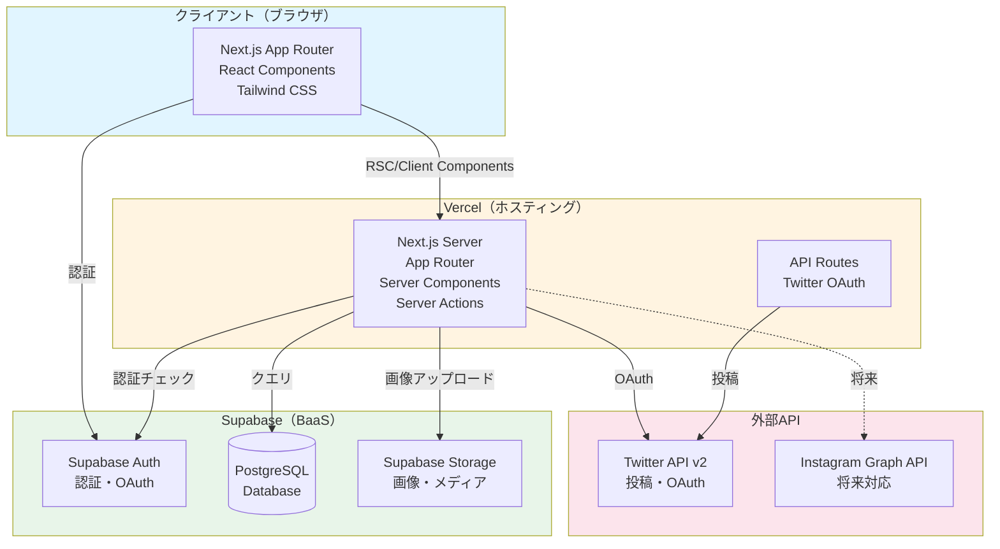
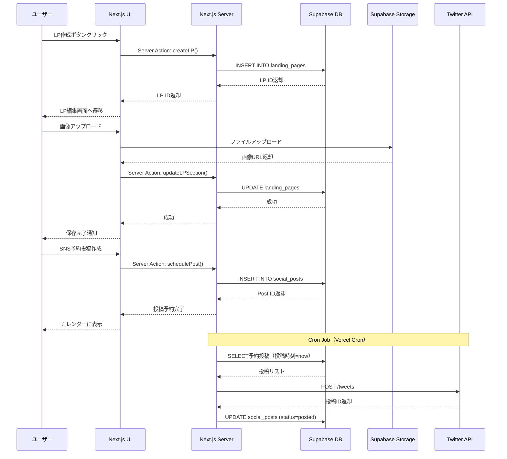
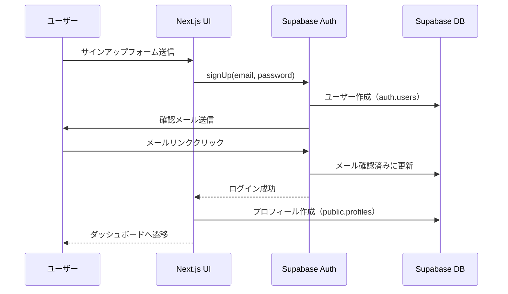
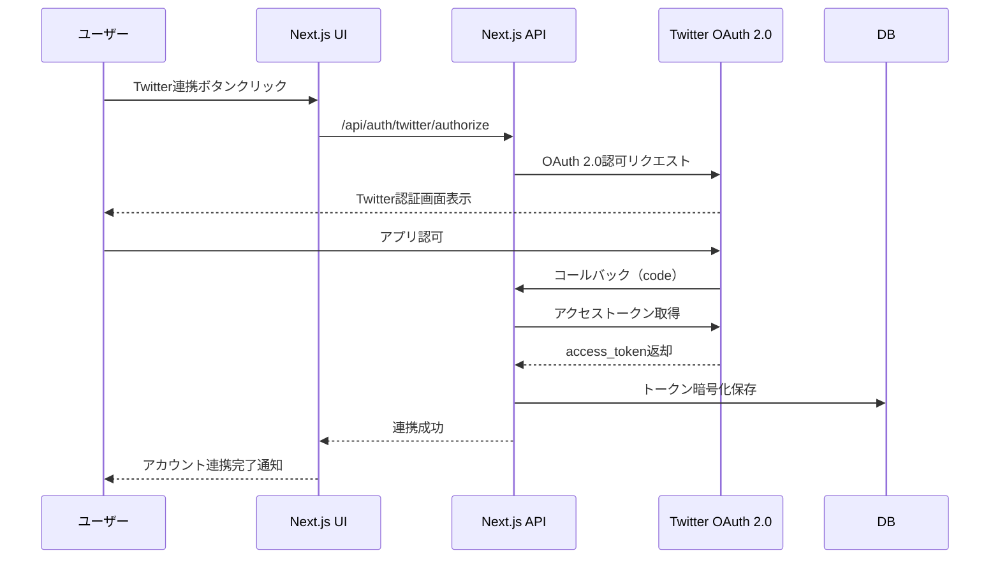

# 技術スタック構成

## 作成日
2025-11-20

## 目次
1. [技術スタック一覧](#技術スタック一覧)
2. [選定理由](#選定理由)
3. [システム構成図](#システム構成図)
4. [ディレクトリ構造](#ディレクトリ構造)
5. [開発環境](#開発環境)

---

## 技術スタック一覧

### コア技術（確定）

| カテゴリ | 技術 | バージョン | 理由 |
|---------|------|-----------|------|
| **フロントエンド** | Next.js | 14+ (App Router) | 制約条件、RSC対応 |
| **バックエンド** | Next.js API Routes / Server Actions | 14+ | フルスタックフレームワーク |
| **言語** | TypeScript | 5.3+ | 制約条件（strict mode） |
| **デプロイ** | Vercel | - | 制約条件、Next.js最適化 |
| **データベース** | Supabase (PostgreSQL) | - | 制約条件、MCP対応 |
| **スタイリング** | Tailwind CSS | 3.4+ | 制約条件、高速開発 |

### 追加技術（選定）

| カテゴリ | 技術 | バージョン | 選定理由 |
|---------|------|-----------|---------|
| **UIコンポーネント** | shadcn/ui | - | Tailwind統合、コピペ可能、カスタマイズ性 |
| **アイコン** | Lucide React | 0.292+ | shadcn/ui推奨、軽量 |
| **フォーム管理** | React Hook Form | 7.48+ | パフォーマンス、型安全 |
| **バリデーション** | Zod | 3.22+ | TypeScript統合、スキーマ定義 |
| **状態管理** | Zustand | 4.4+ | シンプル、軽量、ボイラープレート少 |
| **ドラッグ&ドロップ** | dnd-kit | 6.1+ | モダン、アクセシブル、React対応 |
| **カレンダー** | react-big-calendar | 1.8+ | カスタマイズ性、月表示対応 |
| **日付操作** | date-fns | 3.0+ | 軽量、モジュラー、Tree-shaking対応 |
| **画像最適化** | Next.js Image | 14+ | ビルトイン、自動最適化 |
| **認証** | Supabase Auth | - | Supabase統合、OAuth対応 |
| **ストレージ** | Supabase Storage | - | Supabase統合、画像管理 |
| **ORM/クエリビルダー** | Supabase JS Client | 2.38+ | TypeScript型生成、リアルタイム対応 |
| **SNS連携** | Twitter API v2 | - | OAuth 2.0対応 |
| **エディタ** | TipTap (検討) | 2.1+ | リッチテキスト編集（将来的に） |

### 開発ツール

| カテゴリ | 技術 | バージョン | 理由 |
|---------|------|-----------|------|
| **パッケージマネージャー** | pnpm | 8.10+ | 高速、ディスク効率 |
| **リンター** | ESLint | 8.54+ | Next.js推奨設定 |
| **フォーマッター** | Prettier | 3.1+ | コード統一 |
| **型チェック** | TypeScript Compiler | 5.3+ | 厳格な型チェック |
| **Git Hooks** | Husky + lint-staged | - | コミット前チェック |

---

## 選定理由

### 1. Next.js 14 (App Router)

**選定理由**:
- ✅ 制約条件で指定
- ✅ React Server Components (RSC) で初期ロード高速化
- ✅ Server Actions でAPIルート不要、フォーム処理が簡潔
- ✅ Vercelとの最適な統合
- ✅ 画像最適化、フォント最適化がビルトイン
- ✅ SSR/SSG/ISRの柔軟な選択

**App Router vs Pages Router**:
- App Routerは新しい標準、将来性がある
- RSCでサーバーサイドロジックをシンプルに記述
- レイアウト共有が簡単

### 2. TypeScript (strict mode)

**選定理由**:
- ✅ 制約条件で指定
- ✅ 型安全性で実行時エラー削減
- ✅ IDEサポート強化、開発効率向上
- ✅ リファクタリングが安全
- ✅ Supabaseが型生成サポート

**strict mode設定**:
```json
{
  "compilerOptions": {
    "strict": true,
    "noUncheckedIndexedAccess": true,
    "noImplicitOverride": true
  }
}
```

### 3. Supabase (PostgreSQL)

**選定理由**:
- ✅ 制約条件で指定（MCP対応）
- ✅ PostgreSQL（リレーショナルDB）で複雑なクエリ対応
- ✅ Auth、Storage、Realtime統合
- ✅ TypeScript型自動生成
- ✅ Row Level Security (RLS) でセキュリティ強化
- ✅ 無料プランで開発・小規模運用可能

**Supabase機能**:
- **Supabase Auth**: OAuth (Twitter/X)、メール認証
- **Supabase Storage**: 画像アップロード、CDN統合
- **Supabase Database**: PostgreSQL、リアルタイムサブスクリプション
- **Row Level Security**: ユーザーごとのデータアクセス制御

### 4. Tailwind CSS

**選定理由**:
- ✅ 制約条件で指定
- ✅ ユーティリティファーストで高速開発
- ✅ カスタムCSSが最小限
- ✅ レスポンシブ対応が簡単 (`md:`, `lg:`)
- ✅ ダークモード対応 (`dark:`)
- ✅ Tree-shakingで本番ビルドが小さい

### 5. shadcn/ui

**選定理由**:
- ✅ Tailwind CSSと完全統合
- ✅ コピペでコンポーネント追加（依存なし）
- ✅ Radix UI（アクセシブル）ベース
- ✅ カスタマイズが容易
- ✅ 型安全
- ✅ ダークモード対応

**代替案との比較**:
- ❌ **Material UI**: Tailwindと統合しにくい、重い
- ❌ **Chakra UI**: Tailwindと競合、CSS-in-JS
- ⚠️ **Headless UI**: 良いが、shadcn/uiの方がコンポーネント豊富

### 6. React Hook Form + Zod

**選定理由**:
- ✅ **React Hook Form**: 非制御コンポーネントで高パフォーマンス
- ✅ **Zod**: TypeScript統合、スキーマ定義が簡潔
- ✅ サーバーサイドでもZodスキーマ再利用可能
- ✅ エラーハンドリングが簡単

**使用例**:
```typescript
import { useForm } from 'react-hook-form'
import { zodResolver } from '@hookform/resolvers/zod'
import { z } from 'zod'

const schema = z.object({
  email: z.string().email(),
  password: z.string().min(8),
})

const form = useForm({
  resolver: zodResolver(schema),
})
```

### 7. Zustand（状態管理）

**選定理由**:
- ✅ シンプル、学習コスト低
- ✅ ボイラープレート最小限
- ✅ TypeScript統合
- ✅ Redux DevTools対応
- ✅ 軽量（<1KB）

**代替案との比較**:
- ❌ **Redux Toolkit**: 過剰、ボイラープレート多い
- ⚠️ **Jotai/Recoil**: Atomic、MVPにはシンプルすぎる
- ⚠️ **Context API**: グローバル状態に使うと再レンダー問題

**使用ケース**:
- ユーザー情報
- LP編集中の状態
- SNS投稿下書き

### 8. dnd-kit（ドラッグ&ドロップ）

**選定理由**:
- ✅ モダンなライブラリ（2021〜）
- ✅ アクセシビリティ対応
- ✅ React 18対応
- ✅ カスタマイズ性が高い
- ✅ TypeScript統合

**代替案との比較**:
- ⚠️ **react-beautiful-dnd**: メンテナンス停止気味
- ❌ **react-dnd**: 古い、複雑

**使用ケース**:
- LPビルダーのセクション並び替え
- SNSカレンダーの投稿移動（将来）

### 9. react-big-calendar

**選定理由**:
- ✅ カスタマイズ性が高い
- ✅ 月/週/日表示対応
- ✅ イベント管理機能
- ✅ React統合

**代替案との比較**:
- ⚠️ **FullCalendar**: 有料版が高機能、無料版は制限あり
- ❌ **react-calendar**: シンプルすぎる、イベント管理弱い

**使用ケース**:
- SNS投稿カレンダー
- 予約投稿の視覚化

### 10. date-fns

**選定理由**:
- ✅ 軽量、モジュラー
- ✅ Tree-shaking対応
- ✅ Immutable（副作用なし）
- ✅ TypeScript対応

**代替案との比較**:
- ❌ **Moment.js**: 重い、メンテナンス終了
- ⚠️ **Day.js**: 軽量だが、機能がやや少ない

---

## システム構成図

### アーキテクチャ全体図



### データフロー図



### 認証フロー



### SNS連携フロー（Twitter/X）



---

## ディレクトリ構造

```
BrannonWebKanri/
├── docs/                          # ドキュメント
│   ├── 01_competitive_analysis.md
│   ├── 02_feature_design.md
│   └── 03_tech_stack.md
│
├── src/
│   ├── app/                       # Next.js App Router
│   │   ├── (auth)/                # 認証関連ルート
│   │   │   ├── login/
│   │   │   │   └── page.tsx
│   │   │   ├── signup/
│   │   │   │   └── page.tsx
│   │   │   └── reset-password/
│   │   │       └── page.tsx
│   │   │
│   │   ├── (dashboard)/           # ダッシュボード（認証必須）
│   │   │   ├── layout.tsx         # 共通レイアウト
│   │   │   ├── dashboard/
│   │   │   │   └── page.tsx
│   │   │   ├── lp/
│   │   │   │   ├── page.tsx       # LP一覧
│   │   │   │   ├── new/
│   │   │   │   │   └── page.tsx   # LP作成
│   │   │   │   └── [id]/
│   │   │   │       ├── edit/
│   │   │   │       │   └── page.tsx
│   │   │   │       └── preview/
│   │   │   │           └── page.tsx
│   │   │   ├── social/
│   │   │   │   ├── page.tsx       # SNS管理
│   │   │   │   ├── posts/
│   │   │   │   │   └── page.tsx   # 投稿履歴
│   │   │   │   └── calendar/
│   │   │   │       └── page.tsx   # カレンダー
│   │   │   ├── media/
│   │   │   │   └── page.tsx       # メディアライブラリ
│   │   │   └── settings/
│   │   │       ├── page.tsx       # 設定
│   │   │       ├── profile/
│   │   │       ├── social-accounts/
│   │   │       └── billing/
│   │   │
│   │   ├── lp/                    # 公開LP（認証不要）
│   │   │   └── [userId]/
│   │   │       └── [slug]/
│   │   │           └── page.tsx
│   │   │
│   │   ├── api/                   # API Routes
│   │   │   ├── auth/
│   │   │   │   └── twitter/
│   │   │   │       ├── authorize/
│   │   │   │       └── callback/
│   │   │   └── cron/
│   │   │       └── publish-posts/ # 予約投稿実行
│   │   │
│   │   ├── layout.tsx             # ルートレイアウト
│   │   ├── page.tsx               # トップページ
│   │   └── globals.css            # Tailwind CSS
│   │
│   ├── components/                # Reactコンポーネント
│   │   ├── ui/                    # shadcn/uiコンポーネント
│   │   │   ├── button.tsx
│   │   │   ├── input.tsx
│   │   │   ├── card.tsx
│   │   │   └── ...
│   │   ├── lp/                    # LP関連コンポーネント
│   │   │   ├── builder/
│   │   │   │   ├── LPBuilder.tsx
│   │   │   │   ├── SectionList.tsx
│   │   │   │   └── SectionEditor.tsx
│   │   │   ├── sections/          # LPセクション
│   │   │   │   ├── HeroSection.tsx
│   │   │   │   ├── FeaturesSection.tsx
│   │   │   │   └── ...
│   │   │   └── templates/
│   │   │       └── TemplateCard.tsx
│   │   ├── social/                # SNS関連コンポーネント
│   │   │   ├── PostComposer.tsx
│   │   │   ├── PostCalendar.tsx
│   │   │   └── PostCard.tsx
│   │   ├── media/
│   │   │   ├── MediaLibrary.tsx
│   │   │   └── ImageUploader.tsx
│   │   └── layout/
│   │       ├── Header.tsx
│   │       ├── Sidebar.tsx
│   │       └── Footer.tsx
│   │
│   ├── lib/                       # ユーティリティ・設定
│   │   ├── supabase/
│   │   │   ├── client.ts          # クライアント用Supabaseクライアント
│   │   │   ├── server.ts          # サーバー用Supabaseクライアント
│   │   │   └── types.ts           # 型定義（自動生成）
│   │   ├── twitter/
│   │   │   └── client.ts          # Twitter API クライアント
│   │   ├── validations/           # Zodスキーマ
│   │   │   ├── auth.ts
│   │   │   ├── lp.ts
│   │   │   └── social.ts
│   │   └── utils.ts               # ユーティリティ関数
│   │
│   ├── stores/                    # Zustand状態管理
│   │   ├── lpStore.ts             # LP編集状態
│   │   ├── socialStore.ts         # SNS投稿状態
│   │   └── userStore.ts           # ユーザー情報
│   │
│   ├── types/                     # TypeScript型定義
│   │   ├── lp.ts
│   │   ├── social.ts
│   │   └── database.ts
│   │
│   └── actions/                   # Server Actions
│       ├── lp.ts
│       ├── social.ts
│       └── auth.ts
│
├── public/                        # 静的ファイル
│   ├── templates/                 # LPテンプレート画像
│   └── favicon.ico
│
├── supabase/                      # Supabase設定
│   ├── migrations/                # DBマイグレーション
│   └── seed.sql                   # 初期データ
│
├── .env.local                     # 環境変数
├── .env.example                   # 環境変数サンプル
├── next.config.js                 # Next.js設定
├── tailwind.config.ts             # Tailwind設定
├── tsconfig.json                  # TypeScript設定
├── package.json
├── pnpm-lock.yaml
└── README.md
```

---

## 開発環境

### 必要なツール

| ツール | バージョン | 確認コマンド |
|--------|-----------|-------------|
| Node.js | 18.17+ | `node --version` |
| pnpm | 8.10+ | `pnpm --version` |
| Git | 2.40+ | `git --version` |

### 環境変数（.env.local）

```bash
# Supabase
NEXT_PUBLIC_SUPABASE_URL=https://xxx.supabase.co
NEXT_PUBLIC_SUPABASE_ANON_KEY=eyJhbGc...
SUPABASE_SERVICE_ROLE_KEY=eyJhbGc...

# Twitter API v2
TWITTER_CLIENT_ID=xxx
TWITTER_CLIENT_SECRET=xxx
TWITTER_CALLBACK_URL=http://localhost:3000/api/auth/twitter/callback

# App URL
NEXT_PUBLIC_APP_URL=http://localhost:3000

# 将来的に追加
# STRIPE_SECRET_KEY=sk_test_...
# STRIPE_WEBHOOK_SECRET=whsec_...
```

### セットアップコマンド

```bash
# 依存関係インストール
pnpm install

# Supabase型生成
pnpm supabase gen types typescript --project-id xxx > src/lib/supabase/types.ts

# 開発サーバー起動
pnpm dev

# ビルド
pnpm build

# 本番環境起動
pnpm start

# 型チェック
pnpm type-check

# リント
pnpm lint

# フォーマット
pnpm format
```

---

## パッケージ一覧（package.json）

### 本番依存

```json
{
  "dependencies": {
    "next": "^14.0.4",
    "react": "^18.2.0",
    "react-dom": "^18.2.0",
    "@supabase/supabase-js": "^2.38.4",
    "@supabase/auth-helpers-nextjs": "^0.8.7",
    "zustand": "^4.4.7",
    "react-hook-form": "^7.48.2",
    "@hookform/resolvers": "^3.3.2",
    "zod": "^3.22.4",
    "@dnd-kit/core": "^6.1.0",
    "@dnd-kit/sortable": "^8.0.0",
    "react-big-calendar": "^1.8.5",
    "date-fns": "^3.0.6",
    "lucide-react": "^0.292.0",
    "class-variance-authority": "^0.7.0",
    "clsx": "^2.0.0",
    "tailwind-merge": "^2.1.0"
  }
}
```

### 開発依存

```json
{
  "devDependencies": {
    "typescript": "^5.3.2",
    "@types/node": "^20.10.0",
    "@types/react": "^18.2.42",
    "@types/react-dom": "^18.2.17",
    "tailwindcss": "^3.4.0",
    "postcss": "^8.4.32",
    "autoprefixer": "^10.4.16",
    "eslint": "^8.54.0",
    "eslint-config-next": "^14.0.4",
    "prettier": "^3.1.0",
    "husky": "^8.0.3",
    "lint-staged": "^15.1.0"
  }
}
```

---

## セキュリティ考慮事項

### 1. Supabase Row Level Security (RLS)

すべてのテーブルでRLSを有効化：

```sql
-- 例: landing_pagesテーブル
ALTER TABLE landing_pages ENABLE ROW LEVEL SECURITY;

CREATE POLICY "ユーザーは自分のLPのみ閲覧可能"
ON landing_pages FOR SELECT
USING (auth.uid() = user_id);

CREATE POLICY "ユーザーは自分のLPのみ更新可能"
ON landing_pages FOR UPDATE
USING (auth.uid() = user_id);
```

### 2. 環境変数

- `.env.local`をGit管理外に（`.gitignore`）
- クライアント公開変数は`NEXT_PUBLIC_`プレフィックス
- サーバーのみの変数（`SUPABASE_SERVICE_ROLE_KEY`等）は公開しない

### 3. Twitter OAuth トークン

- アクセストークンは暗号化してDB保存
- リフレッシュトークンで定期更新
- トークン漏洩時の無効化機能

### 4. CSRFトークン

- Server ActionsはビルトインでCSRF保護

### 5. XSS対策

- Reactのデフォルトエスケープ
- `dangerouslySetInnerHTML`は避ける
- ユーザー入力をサニタイズ

---

## パフォーマンス最適化

### 1. Next.js最適化

- **RSC（React Server Components）**: データフェッチをサーバーで
- **Dynamic Import**: 大きいコンポーネントは遅延読み込み
- **Image最適化**: `next/image`でWebP自動変換

### 2. Tailwind CSS最適化

- **PurgeCSS**: 未使用CSSを本番ビルドで削除
- **JIT Mode**: オンデマンドでCSS生成

### 3. データベース最適化

- **インデックス**: よく検索するカラムにインデックス
- **ページネーション**: 大量データは分割取得

### 4. 画像最適化

- **Supabase Storage変換**: リサイズ、WebP変換
- **CDN**: Supabase CDN経由で配信

---

## まとめ

### 技術スタックの特徴

1. ✅ **モダンで将来性がある**: Next.js 14、RSC、TypeScript
2. ✅ **開発速度重視**: Supabase、shadcn/ui、Tailwind
3. ✅ **型安全**: TypeScript strict mode、Zod、Supabase型生成
4. ✅ **スケーラブル**: PostgreSQL、Vercel、Supabase
5. ✅ **コスト効率**: Supabase無料プラン、Vercel無料プラン

### 次のステップ

Phase 4: データベース設計とスキーマ定義

---

**作成日**: 2025-11-20
