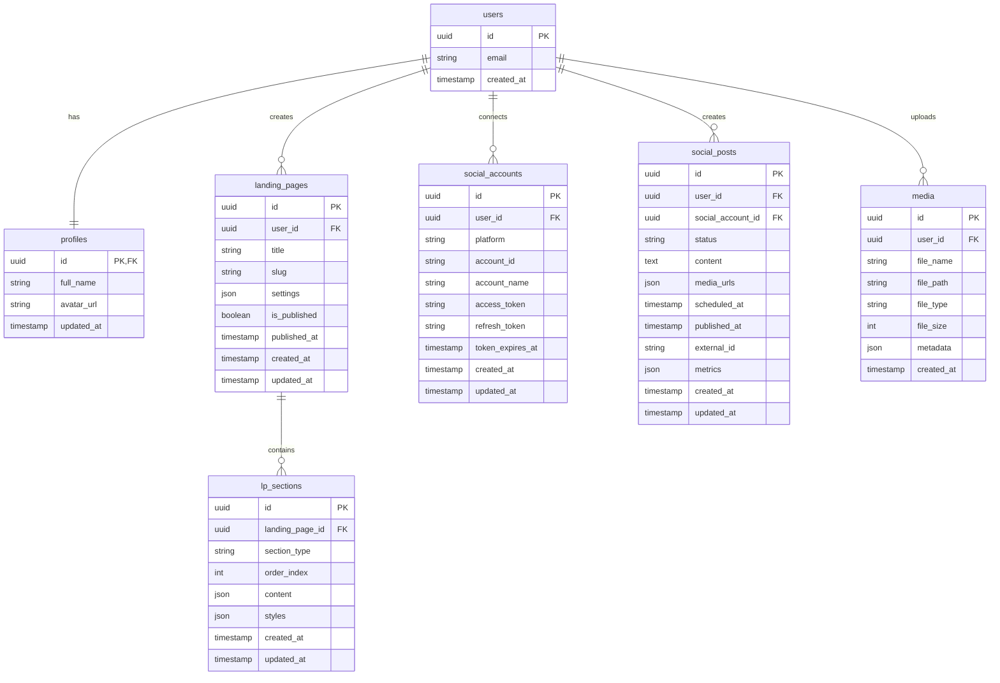

# データベース設計

## 作成日
2025-11-20

## 目次
1. [ER図](#er図)
2. [テーブル定義](#テーブル定義)
3. [インデックス設計](#インデックス設計)
4. [Row Level Security (RLS)](#row-level-security-rls)
5. [マイグレーションSQL](#マイグレーションsql)

---

## ER図



---

## テーブル定義

### 1. profiles（ユーザープロフィール）

| カラム名 | 型 | 制約 | デフォルト | 説明 |
|---------|-----|------|-----------|------|
| id | uuid | PK, FK | - | auth.users.id |
| full_name | text | - | NULL | ユーザー名 |
| avatar_url | text | - | NULL | プロフィール画像URL |
| updated_at | timestamptz | NOT NULL | now() | 更新日時 |

**備考**:
- `auth.users`はSupabaseが管理（メール、パスワード等）
- `profiles`は追加のユーザー情報を格納

---

### 2. landing_pages（ランディングページ）

| カラム名 | 型 | 制約 | デフォルト | 説明 |
|---------|-----|------|-----------|------|
| id | uuid | PK | uuid_generate_v4() | LP ID |
| user_id | uuid | FK, NOT NULL | - | 作成者（auth.users.id） |
| title | text | NOT NULL | - | LPタイトル（内部管理用） |
| slug | text | NOT NULL | - | URL用スラッグ |
| settings | jsonb | NOT NULL | '{}' | LP設定（SEO、OGP等） |
| is_published | boolean | NOT NULL | false | 公開フラグ |
| published_at | timestamptz | - | NULL | 公開日時 |
| created_at | timestamptz | NOT NULL | now() | 作成日時 |
| updated_at | timestamptz | NOT NULL | now() | 更新日時 |

**settings JSON構造**:
```json
{
  "seo": {
    "title": "ページタイトル",
    "description": "ページ説明",
    "keywords": ["キーワード1", "キーワード2"]
  },
  "ogp": {
    "image": "https://...",
    "title": "OGPタイトル",
    "description": "OGP説明"
  },
  "branding": {
    "primaryColor": "#3B82F6",
    "secondaryColor": "#10B981",
    "fontFamily": "Inter"
  },
  "favicon": "https://..."
}
```

**制約**:
- UNIQUE (user_id, slug): 同一ユーザー内でslugは一意

---

### 3. lp_sections（LPセクション）

| カラム名 | 型 | 制約 | デフォルト | 説明 |
|---------|-----|------|-----------|------|
| id | uuid | PK | uuid_generate_v4() | セクションID |
| landing_page_id | uuid | FK, NOT NULL | - | 所属LP |
| section_type | text | NOT NULL | - | セクション種類 |
| order_index | int | NOT NULL | - | 表示順序 |
| content | jsonb | NOT NULL | '{}' | セクション内容 |
| styles | jsonb | NOT NULL | '{}' | カスタムスタイル |
| created_at | timestamptz | NOT NULL | now() | 作成日時 |
| updated_at | timestamptz | NOT NULL | now() | 更新日時 |

**section_type値**:
- `header`: ヘッダー
- `hero`: ヒーローセクション
- `features`: 特徴・サービス紹介
- `about`: About Us
- `pricing`: 料金表
- `testimonial`: お客様の声
- `cta`: Call to Action
- `contact`: 問い合わせフォーム
- `footer`: フッター

**content JSON構造例（hero）**:
```json
{
  "heading": "あなたのビジネスを加速させる",
  "subheading": "簡単・早い・低価格",
  "ctaText": "今すぐ始める",
  "ctaLink": "#contact",
  "backgroundImage": "https://...",
  "alignment": "center"
}
```

**content JSON構造例（features）**:
```json
{
  "heading": "私たちの強み",
  "items": [
    {
      "icon": "zap",
      "title": "高速",
      "description": "最新技術で高速なサイトを実現"
    },
    {
      "icon": "shield",
      "title": "安全",
      "description": "セキュリティ対策万全"
    }
  ]
}
```

**styles JSON構造**:
```json
{
  "backgroundColor": "#FFFFFF",
  "textColor": "#000000",
  "padding": "80px 0",
  "customCSS": ""
}
```

**制約**:
- UNIQUE (landing_page_id, order_index): 同一LP内で順序は一意

---

### 4. social_accounts（SNSアカウント連携）

| カラム名 | 型 | 制約 | デフォルト | 説明 |
|---------|-----|------|-----------|------|
| id | uuid | PK | uuid_generate_v4() | アカウントID |
| user_id | uuid | FK, NOT NULL | - | ユーザー（auth.users.id） |
| platform | text | NOT NULL | - | SNSプラットフォーム |
| account_id | text | NOT NULL | - | SNSのユーザーID |
| account_name | text | NOT NULL | - | SNSの表示名 |
| account_username | text | - | NULL | ユーザー名（@xxx） |
| access_token | text | NOT NULL | - | アクセストークン（暗号化） |
| refresh_token | text | - | NULL | リフレッシュトークン（暗号化） |
| token_expires_at | timestamptz | - | NULL | トークン有効期限 |
| created_at | timestamptz | NOT NULL | now() | 連携日時 |
| updated_at | timestamptz | NOT NULL | now() | 更新日時 |

**platform値**:
- `twitter`: Twitter/X
- `instagram`: Instagram
- `facebook`: Facebook
- （将来）`linkedin`, `pinterest`, `tiktok`

**制約**:
- UNIQUE (user_id, platform, account_id): 同一ユーザー、同一プラットフォーム、同一アカウントは1つのみ

**セキュリティ**:
- `access_token`, `refresh_token`は暗号化して保存（Supabase Vault使用予定）

---

### 5. social_posts（SNS投稿）

| カラム名 | 型 | 制約 | デフォルト | 説明 |
|---------|-----|------|-----------|------|
| id | uuid | PK | uuid_generate_v4() | 投稿ID |
| user_id | uuid | FK, NOT NULL | - | ユーザー（auth.users.id） |
| social_account_id | uuid | FK, NOT NULL | - | 投稿先アカウント |
| status | text | NOT NULL | 'draft' | 投稿ステータス |
| content | text | NOT NULL | - | 投稿内容 |
| media_urls | jsonb | NOT NULL | '[]' | 画像・動画URL配列 |
| scheduled_at | timestamptz | - | NULL | 予約投稿日時 |
| published_at | timestamptz | - | NULL | 実際の投稿日時 |
| external_id | text | - | NULL | SNS側の投稿ID |
| metrics | jsonb | - | NULL | エンゲージメント指標 |
| error_message | text | - | NULL | エラーメッセージ |
| created_at | timestamptz | NOT NULL | now() | 作成日時 |
| updated_at | timestamptz | NOT NULL | now() | 更新日時 |

**status値**:
- `draft`: 下書き
- `scheduled`: 予約済み
- `publishing`: 投稿中
- `published`: 投稿完了
- `failed`: 投稿失敗
- `deleted`: 削除済み

**media_urls JSON構造**:
```json
[
  {
    "url": "https://...",
    "type": "image",
    "alt": "画像の説明"
  }
]
```

**metrics JSON構造**:
```json
{
  "likes": 42,
  "retweets": 12,
  "replies": 5,
  "impressions": 1234,
  "lastFetchedAt": "2025-11-20T12:00:00Z"
}
```

---

### 6. media（メディアライブラリ）

| カラム名 | 型 | 制約 | デフォルト | 説明 |
|---------|-----|------|-----------|------|
| id | uuid | PK | uuid_generate_v4() | メディアID |
| user_id | uuid | FK, NOT NULL | - | ユーザー（auth.users.id） |
| file_name | text | NOT NULL | - | ファイル名 |
| file_path | text | NOT NULL | - | Supabase Storageパス |
| file_type | text | NOT NULL | - | MIMEタイプ |
| file_size | int | NOT NULL | - | ファイルサイズ（bytes） |
| width | int | - | NULL | 画像幅（px） |
| height | int | - | NULL | 画像高さ（px） |
| metadata | jsonb | NOT NULL | '{}' | 追加メタデータ |
| created_at | timestamptz | NOT NULL | now() | アップロード日時 |

**file_type値**:
- `image/png`, `image/jpeg`, `image/webp`, `image/gif`
- （将来）`video/mp4`

**metadata JSON構造**:
```json
{
  "originalName": "my-photo.jpg",
  "alt": "画像の説明",
  "tags": ["ネイル", "デザイン"],
  "usedIn": {
    "landingPages": ["lp-id-1"],
    "socialPosts": ["post-id-1"]
  }
}
```

---

## インデックス設計

### 検索パフォーマンス最適化

```sql
-- landing_pages
CREATE INDEX idx_landing_pages_user_id ON landing_pages(user_id);
CREATE INDEX idx_landing_pages_slug ON landing_pages(slug);
CREATE INDEX idx_landing_pages_is_published ON landing_pages(is_published);
CREATE INDEX idx_landing_pages_user_id_slug ON landing_pages(user_id, slug);

-- lp_sections
CREATE INDEX idx_lp_sections_landing_page_id ON lp_sections(landing_page_id);
CREATE INDEX idx_lp_sections_landing_page_id_order ON lp_sections(landing_page_id, order_index);

-- social_accounts
CREATE INDEX idx_social_accounts_user_id ON social_accounts(user_id);
CREATE INDEX idx_social_accounts_platform ON social_accounts(platform);

-- social_posts
CREATE INDEX idx_social_posts_user_id ON social_posts(user_id);
CREATE INDEX idx_social_posts_social_account_id ON social_posts(social_account_id);
CREATE INDEX idx_social_posts_status ON social_posts(status);
CREATE INDEX idx_social_posts_scheduled_at ON social_posts(scheduled_at) WHERE status = 'scheduled';
CREATE INDEX idx_social_posts_user_id_status ON social_posts(user_id, status);

-- media
CREATE INDEX idx_media_user_id ON media(user_id);
CREATE INDEX idx_media_file_type ON media(file_type);
```

---

## Row Level Security (RLS)

### 基本方針

1. ✅ すべてのテーブルでRLSを有効化
2. ✅ ユーザーは自分のデータのみ読み書き可能
3. ✅ 公開LPは認証なしで閲覧可能
4. ✅ 管理者権限は後から追加可能

---

### RLSポリシー定義

#### 1. profiles

```sql
-- RLS有効化
ALTER TABLE profiles ENABLE ROW LEVEL SECURITY;

-- ポリシー: 自分のプロフィールのみ閲覧可能
CREATE POLICY "ユーザーは自分のプロフィールのみ閲覧可能"
ON profiles FOR SELECT
USING (auth.uid() = id);

-- ポリシー: 自分のプロフィールのみ更新可能
CREATE POLICY "ユーザーは自分のプロフィールのみ更新可能"
ON profiles FOR UPDATE
USING (auth.uid() = id);

-- ポリシー: 新規ユーザーは自動でプロフィール作成
CREATE POLICY "ユーザーは自分のプロフィールを作成可能"
ON profiles FOR INSERT
WITH CHECK (auth.uid() = id);
```

#### 2. landing_pages

```sql
ALTER TABLE landing_pages ENABLE ROW LEVEL SECURITY;

-- ポリシー: 自分のLPのみ閲覧可能
CREATE POLICY "ユーザーは自分のLPのみ閲覧可能"
ON landing_pages FOR SELECT
USING (auth.uid() = user_id);

-- ポリシー: 公開LPは誰でも閲覧可能（認証不要）
CREATE POLICY "公開LPは誰でも閲覧可能"
ON landing_pages FOR SELECT
USING (is_published = true);

-- ポリシー: 自分のLPのみ作成可能
CREATE POLICY "ユーザーは自分のLPを作成可能"
ON landing_pages FOR INSERT
WITH CHECK (auth.uid() = user_id);

-- ポリシー: 自分のLPのみ更新可能
CREATE POLICY "ユーザーは自分のLPのみ更新可能"
ON landing_pages FOR UPDATE
USING (auth.uid() = user_id);

-- ポリシー: 自分のLPのみ削除可能
CREATE POLICY "ユーザーは自分のLPのみ削除可能"
ON landing_pages FOR DELETE
USING (auth.uid() = user_id);
```

#### 3. lp_sections

```sql
ALTER TABLE lp_sections ENABLE ROW LEVEL SECURITY;

-- ポリシー: 自分のLPのセクションのみ閲覧可能
CREATE POLICY "ユーザーは自分のLPのセクションのみ閲覧可能"
ON lp_sections FOR SELECT
USING (
  EXISTS (
    SELECT 1 FROM landing_pages
    WHERE landing_pages.id = lp_sections.landing_page_id
    AND landing_pages.user_id = auth.uid()
  )
);

-- ポリシー: 公開LPのセクションは誰でも閲覧可能
CREATE POLICY "公開LPのセクションは誰でも閲覧可能"
ON lp_sections FOR SELECT
USING (
  EXISTS (
    SELECT 1 FROM landing_pages
    WHERE landing_pages.id = lp_sections.landing_page_id
    AND landing_pages.is_published = true
  )
);

-- ポリシー: 自分のLPのセクションのみ作成可能
CREATE POLICY "ユーザーは自分のLPのセクションを作成可能"
ON lp_sections FOR INSERT
WITH CHECK (
  EXISTS (
    SELECT 1 FROM landing_pages
    WHERE landing_pages.id = lp_sections.landing_page_id
    AND landing_pages.user_id = auth.uid()
  )
);

-- ポリシー: 自分のLPのセクションのみ更新可能
CREATE POLICY "ユーザーは自分のLPのセクションのみ更新可能"
ON lp_sections FOR UPDATE
USING (
  EXISTS (
    SELECT 1 FROM landing_pages
    WHERE landing_pages.id = lp_sections.landing_page_id
    AND landing_pages.user_id = auth.uid()
  )
);

-- ポリシー: 自分のLPのセクションのみ削除可能
CREATE POLICY "ユーザーは自分のLPのセクションのみ削除可能"
ON lp_sections FOR DELETE
USING (
  EXISTS (
    SELECT 1 FROM landing_pages
    WHERE landing_pages.id = lp_sections.landing_page_id
    AND landing_pages.user_id = auth.uid()
  )
);
```

#### 4. social_accounts

```sql
ALTER TABLE social_accounts ENABLE ROW LEVEL SECURITY;

-- ポリシー: 自分のSNSアカウントのみ閲覧可能
CREATE POLICY "ユーザーは自分のSNSアカウントのみ閲覧可能"
ON social_accounts FOR SELECT
USING (auth.uid() = user_id);

-- ポリシー: 自分のSNSアカウントのみ作成可能
CREATE POLICY "ユーザーは自分のSNSアカウントを作成可能"
ON social_accounts FOR INSERT
WITH CHECK (auth.uid() = user_id);

-- ポリシー: 自分のSNSアカウントのみ更新可能
CREATE POLICY "ユーザーは自分のSNSアカウントのみ更新可能"
ON social_accounts FOR UPDATE
USING (auth.uid() = user_id);

-- ポリシー: 自分のSNSアカウントのみ削除可能
CREATE POLICY "ユーザーは自分のSNSアカウントのみ削除可能"
ON social_accounts FOR DELETE
USING (auth.uid() = user_id);
```

#### 5. social_posts

```sql
ALTER TABLE social_posts ENABLE ROW LEVEL SECURITY;

-- ポリシー: 自分の投稿のみ閲覧可能
CREATE POLICY "ユーザーは自分の投稿のみ閲覧可能"
ON social_posts FOR SELECT
USING (auth.uid() = user_id);

-- ポリシー: 自分の投稿のみ作成可能
CREATE POLICY "ユーザーは自分の投稿を作成可能"
ON social_posts FOR INSERT
WITH CHECK (auth.uid() = user_id);

-- ポリシー: 自分の投稿のみ更新可能
CREATE POLICY "ユーザーは自分の投稿のみ更新可能"
ON social_posts FOR UPDATE
USING (auth.uid() = user_id);

-- ポリシー: 自分の投稿のみ削除可能
CREATE POLICY "ユーザーは自分の投稿のみ削除可能"
ON social_posts FOR DELETE
USING (auth.uid() = user_id);
```

#### 6. media

```sql
ALTER TABLE media ENABLE ROW LEVEL SECURITY;

-- ポリシー: 自分のメディアのみ閲覧可能
CREATE POLICY "ユーザーは自分のメディアのみ閲覧可能"
ON media FOR SELECT
USING (auth.uid() = user_id);

-- ポリシー: 自分のメディアのみ作成可能
CREATE POLICY "ユーザーは自分のメディアを作成可能"
ON media FOR INSERT
WITH CHECK (auth.uid() = user_id);

-- ポリシー: 自分のメディアのみ削除可能
CREATE POLICY "ユーザーは自分のメディアのみ削除可能"
ON media FOR DELETE
USING (auth.uid() = user_id);
```

---

## マイグレーションSQL

### 初期マイグレーション（001_initial_schema.sql）

```sql
-- UUID拡張を有効化
CREATE EXTENSION IF NOT EXISTS "uuid-ossp";

-- ======================================
-- 1. profiles テーブル
-- ======================================
CREATE TABLE profiles (
  id UUID PRIMARY KEY REFERENCES auth.users(id) ON DELETE CASCADE,
  full_name TEXT,
  avatar_url TEXT,
  updated_at TIMESTAMPTZ NOT NULL DEFAULT NOW()
);

ALTER TABLE profiles ENABLE ROW LEVEL SECURITY;

CREATE POLICY "ユーザーは自分のプロフィールのみ閲覧可能"
ON profiles FOR SELECT USING (auth.uid() = id);

CREATE POLICY "ユーザーは自分のプロフィールのみ更新可能"
ON profiles FOR UPDATE USING (auth.uid() = id);

CREATE POLICY "ユーザーは自分のプロフィールを作成可能"
ON profiles FOR INSERT WITH CHECK (auth.uid() = id);

-- ======================================
-- 2. landing_pages テーブル
-- ======================================
CREATE TABLE landing_pages (
  id UUID PRIMARY KEY DEFAULT uuid_generate_v4(),
  user_id UUID NOT NULL REFERENCES auth.users(id) ON DELETE CASCADE,
  title TEXT NOT NULL,
  slug TEXT NOT NULL,
  settings JSONB NOT NULL DEFAULT '{}'::jsonb,
  is_published BOOLEAN NOT NULL DEFAULT false,
  published_at TIMESTAMPTZ,
  created_at TIMESTAMPTZ NOT NULL DEFAULT NOW(),
  updated_at TIMESTAMPTZ NOT NULL DEFAULT NOW(),
  UNIQUE (user_id, slug)
);

CREATE INDEX idx_landing_pages_user_id ON landing_pages(user_id);
CREATE INDEX idx_landing_pages_slug ON landing_pages(slug);
CREATE INDEX idx_landing_pages_is_published ON landing_pages(is_published);
CREATE INDEX idx_landing_pages_user_id_slug ON landing_pages(user_id, slug);

ALTER TABLE landing_pages ENABLE ROW LEVEL SECURITY;

CREATE POLICY "ユーザーは自分のLPのみ閲覧可能"
ON landing_pages FOR SELECT USING (auth.uid() = user_id);

CREATE POLICY "公開LPは誰でも閲覧可能"
ON landing_pages FOR SELECT USING (is_published = true);

CREATE POLICY "ユーザーは自分のLPを作成可能"
ON landing_pages FOR INSERT WITH CHECK (auth.uid() = user_id);

CREATE POLICY "ユーザーは自分のLPのみ更新可能"
ON landing_pages FOR UPDATE USING (auth.uid() = user_id);

CREATE POLICY "ユーザーは自分のLPのみ削除可能"
ON landing_pages FOR DELETE USING (auth.uid() = user_id);

-- ======================================
-- 3. lp_sections テーブル
-- ======================================
CREATE TABLE lp_sections (
  id UUID PRIMARY KEY DEFAULT uuid_generate_v4(),
  landing_page_id UUID NOT NULL REFERENCES landing_pages(id) ON DELETE CASCADE,
  section_type TEXT NOT NULL,
  order_index INTEGER NOT NULL,
  content JSONB NOT NULL DEFAULT '{}'::jsonb,
  styles JSONB NOT NULL DEFAULT '{}'::jsonb,
  created_at TIMESTAMPTZ NOT NULL DEFAULT NOW(),
  updated_at TIMESTAMPTZ NOT NULL DEFAULT NOW(),
  UNIQUE (landing_page_id, order_index)
);

CREATE INDEX idx_lp_sections_landing_page_id ON lp_sections(landing_page_id);
CREATE INDEX idx_lp_sections_landing_page_id_order ON lp_sections(landing_page_id, order_index);

ALTER TABLE lp_sections ENABLE ROW LEVEL SECURITY;

CREATE POLICY "ユーザーは自分のLPのセクションのみ閲覧可能"
ON lp_sections FOR SELECT
USING (
  EXISTS (
    SELECT 1 FROM landing_pages
    WHERE landing_pages.id = lp_sections.landing_page_id
    AND landing_pages.user_id = auth.uid()
  )
);

CREATE POLICY "公開LPのセクションは誰でも閲覧可能"
ON lp_sections FOR SELECT
USING (
  EXISTS (
    SELECT 1 FROM landing_pages
    WHERE landing_pages.id = lp_sections.landing_page_id
    AND landing_pages.is_published = true
  )
);

CREATE POLICY "ユーザーは自分のLPのセクションを作成可能"
ON lp_sections FOR INSERT
WITH CHECK (
  EXISTS (
    SELECT 1 FROM landing_pages
    WHERE landing_pages.id = lp_sections.landing_page_id
    AND landing_pages.user_id = auth.uid()
  )
);

CREATE POLICY "ユーザーは自分のLPのセクションのみ更新可能"
ON lp_sections FOR UPDATE
USING (
  EXISTS (
    SELECT 1 FROM landing_pages
    WHERE landing_pages.id = lp_sections.landing_page_id
    AND landing_pages.user_id = auth.uid()
  )
);

CREATE POLICY "ユーザーは自分のLPのセクションのみ削除可能"
ON lp_sections FOR DELETE
USING (
  EXISTS (
    SELECT 1 FROM landing_pages
    WHERE landing_pages.id = lp_sections.landing_page_id
    AND landing_pages.user_id = auth.uid()
  )
);

-- ======================================
-- 4. social_accounts テーブル
-- ======================================
CREATE TABLE social_accounts (
  id UUID PRIMARY KEY DEFAULT uuid_generate_v4(),
  user_id UUID NOT NULL REFERENCES auth.users(id) ON DELETE CASCADE,
  platform TEXT NOT NULL,
  account_id TEXT NOT NULL,
  account_name TEXT NOT NULL,
  account_username TEXT,
  access_token TEXT NOT NULL,
  refresh_token TEXT,
  token_expires_at TIMESTAMPTZ,
  created_at TIMESTAMPTZ NOT NULL DEFAULT NOW(),
  updated_at TIMESTAMPTZ NOT NULL DEFAULT NOW(),
  UNIQUE (user_id, platform, account_id)
);

CREATE INDEX idx_social_accounts_user_id ON social_accounts(user_id);
CREATE INDEX idx_social_accounts_platform ON social_accounts(platform);

ALTER TABLE social_accounts ENABLE ROW LEVEL SECURITY;

CREATE POLICY "ユーザーは自分のSNSアカウントのみ閲覧可能"
ON social_accounts FOR SELECT USING (auth.uid() = user_id);

CREATE POLICY "ユーザーは自分のSNSアカウントを作成可能"
ON social_accounts FOR INSERT WITH CHECK (auth.uid() = user_id);

CREATE POLICY "ユーザーは自分のSNSアカウントのみ更新可能"
ON social_accounts FOR UPDATE USING (auth.uid() = user_id);

CREATE POLICY "ユーザーは自分のSNSアカウントのみ削除可能"
ON social_accounts FOR DELETE USING (auth.uid() = user_id);

-- ======================================
-- 5. social_posts テーブル
-- ======================================
CREATE TABLE social_posts (
  id UUID PRIMARY KEY DEFAULT uuid_generate_v4(),
  user_id UUID NOT NULL REFERENCES auth.users(id) ON DELETE CASCADE,
  social_account_id UUID NOT NULL REFERENCES social_accounts(id) ON DELETE CASCADE,
  status TEXT NOT NULL DEFAULT 'draft',
  content TEXT NOT NULL,
  media_urls JSONB NOT NULL DEFAULT '[]'::jsonb,
  scheduled_at TIMESTAMPTZ,
  published_at TIMESTAMPTZ,
  external_id TEXT,
  metrics JSONB,
  error_message TEXT,
  created_at TIMESTAMPTZ NOT NULL DEFAULT NOW(),
  updated_at TIMESTAMPTZ NOT NULL DEFAULT NOW()
);

CREATE INDEX idx_social_posts_user_id ON social_posts(user_id);
CREATE INDEX idx_social_posts_social_account_id ON social_posts(social_account_id);
CREATE INDEX idx_social_posts_status ON social_posts(status);
CREATE INDEX idx_social_posts_scheduled_at ON social_posts(scheduled_at) WHERE status = 'scheduled';
CREATE INDEX idx_social_posts_user_id_status ON social_posts(user_id, status);

ALTER TABLE social_posts ENABLE ROW LEVEL SECURITY;

CREATE POLICY "ユーザーは自分の投稿のみ閲覧可能"
ON social_posts FOR SELECT USING (auth.uid() = user_id);

CREATE POLICY "ユーザーは自分の投稿を作成可能"
ON social_posts FOR INSERT WITH CHECK (auth.uid() = user_id);

CREATE POLICY "ユーザーは自分の投稿のみ更新可能"
ON social_posts FOR UPDATE USING (auth.uid() = user_id);

CREATE POLICY "ユーザーは自分の投稿のみ削除可能"
ON social_posts FOR DELETE USING (auth.uid() = user_id);

-- ======================================
-- 6. media テーブル
-- ======================================
CREATE TABLE media (
  id UUID PRIMARY KEY DEFAULT uuid_generate_v4(),
  user_id UUID NOT NULL REFERENCES auth.users(id) ON DELETE CASCADE,
  file_name TEXT NOT NULL,
  file_path TEXT NOT NULL,
  file_type TEXT NOT NULL,
  file_size INTEGER NOT NULL,
  width INTEGER,
  height INTEGER,
  metadata JSONB NOT NULL DEFAULT '{}'::jsonb,
  created_at TIMESTAMPTZ NOT NULL DEFAULT NOW()
);

CREATE INDEX idx_media_user_id ON media(user_id);
CREATE INDEX idx_media_file_type ON media(file_type);

ALTER TABLE media ENABLE ROW LEVEL SECURITY;

CREATE POLICY "ユーザーは自分のメディアのみ閲覧可能"
ON media FOR SELECT USING (auth.uid() = user_id);

CREATE POLICY "ユーザーは自分のメディアを作成可能"
ON media FOR INSERT WITH CHECK (auth.uid() = user_id);

CREATE POLICY "ユーザーは自分のメディアのみ削除可能"
ON media FOR DELETE USING (auth.uid() = user_id);

-- ======================================
-- トリガー: updated_at自動更新
-- ======================================
CREATE OR REPLACE FUNCTION update_updated_at_column()
RETURNS TRIGGER AS $$
BEGIN
  NEW.updated_at = NOW();
  RETURN NEW;
END;
$$ LANGUAGE plpgsql;

CREATE TRIGGER update_profiles_updated_at
BEFORE UPDATE ON profiles
FOR EACH ROW
EXECUTE FUNCTION update_updated_at_column();

CREATE TRIGGER update_landing_pages_updated_at
BEFORE UPDATE ON landing_pages
FOR EACH ROW
EXECUTE FUNCTION update_updated_at_column();

CREATE TRIGGER update_lp_sections_updated_at
BEFORE UPDATE ON lp_sections
FOR EACH ROW
EXECUTE FUNCTION update_updated_at_column();

CREATE TRIGGER update_social_accounts_updated_at
BEFORE UPDATE ON social_accounts
FOR EACH ROW
EXECUTE FUNCTION update_updated_at_column();

CREATE TRIGGER update_social_posts_updated_at
BEFORE UPDATE ON social_posts
FOR EACH ROW
EXECUTE FUNCTION update_updated_at_column();

-- ======================================
-- トリガー: 新規ユーザー登録時にプロフィール自動作成
-- ======================================
CREATE OR REPLACE FUNCTION public.handle_new_user()
RETURNS TRIGGER AS $$
BEGIN
  INSERT INTO public.profiles (id, full_name, avatar_url, updated_at)
  VALUES (
    NEW.id,
    NEW.raw_user_meta_data->>'full_name',
    NEW.raw_user_meta_data->>'avatar_url',
    NOW()
  );
  RETURN NEW;
END;
$$ LANGUAGE plpgsql SECURITY DEFINER;

CREATE TRIGGER on_auth_user_created
AFTER INSERT ON auth.users
FOR EACH ROW
EXECUTE FUNCTION public.handle_new_user();
```

---

## シードデータ（seed.sql）

```sql
-- テンプレートデータ（将来的に追加）
-- 開発用テストデータ等
```

---

## まとめ

### データベース設計の特徴

1. ✅ **PostgreSQLリレーショナルDB**: 複雑なクエリ対応
2. ✅ **JSONB型**: 柔軟なスキーマ（LP設定、セクション内容）
3. ✅ **RLS（Row Level Security）**: 堅牢なセキュリティ
4. ✅ **インデックス最適化**: 検索パフォーマンス向上
5. ✅ **カスケード削除**: データ整合性保証
6. ✅ **トリガー**: 自動更新（updated_at、プロフィール作成）

### 次のステップ

Phase 5-1: プロジェクトセットアップ
- Next.jsプロジェクト初期化
- Supabase接続設定
- マイグレーション実行

---

**作成日**: 2025-11-20
